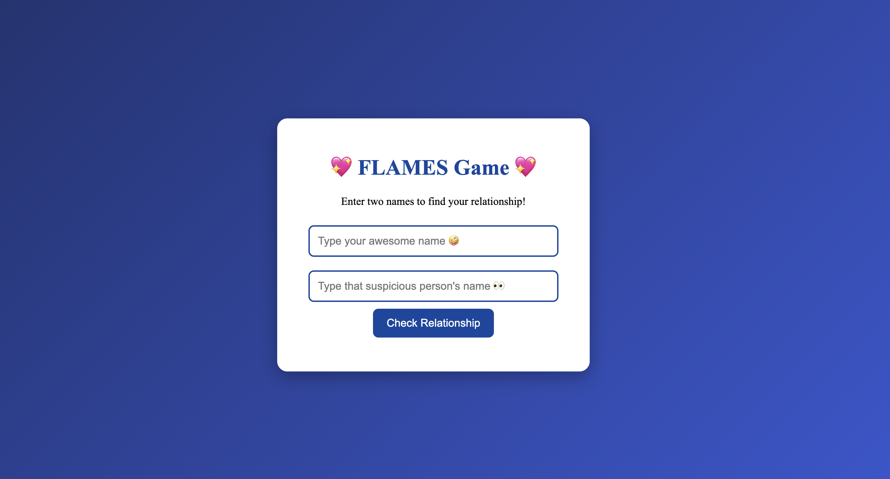

# 💖 FLAMES Game 💖

A fun little game to find out the "relationship" between two names — based on the classic **FLAMES** concept.  
Built with **HTML**, **CSS**, and **JavaScript**.

---

## 🎮 How to Play

1. Enter your name and another person's name.  
2. Click **Check Relationship**.  
3. See the result with a fun, quirky quote!  

---

## 📂 Project Structure

| File | Description |
|------|-------------|
| `index.html` | Main game page |
| `style.css` | Styling |
| `script.js` | Game logic |
| `demo.mp4` | Demo video of gameplay |
| `screenshot.png` | Screenshot of the game |

---

## 🖼 Demo

Or watch the gameplay demo:
[Watch the demo video](demo.mp4)

<video width="400" controls>
  <source src="demo.mp4" type="video/mp4">
  Your browser does not support HTML video.
</video>

---

## 🚀 Play Online

You can host your game on GitHub Pages:

1. Go to **Settings → Pages** in your repository.  
2. Select the **main branch** and **root folder**.  
3. Your game will be available at:

[https://shravs157-59.github.io/flames-game/](https://shravs157-59.github.io/flames-game/)

Enjoy! 🎉

---

## 💻 Built With

- HTML  
- CSS  
- JavaScript  

---

## 📝 License

This project is open source and free to use.
